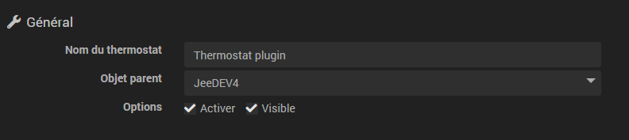
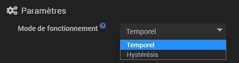
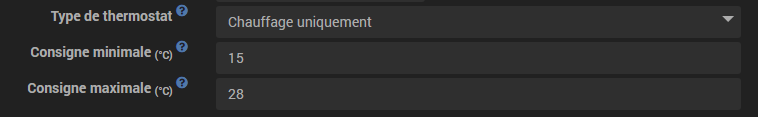
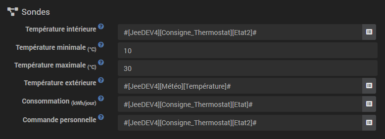
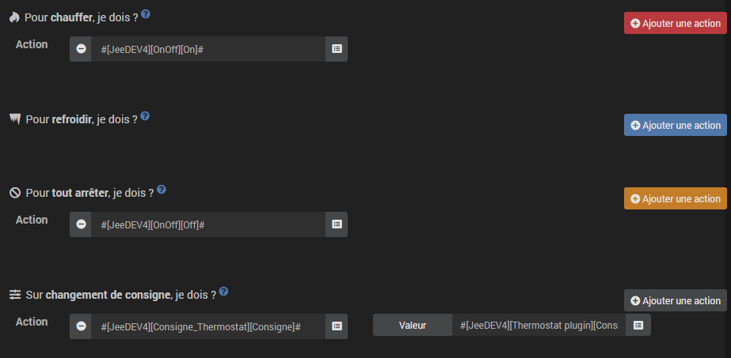
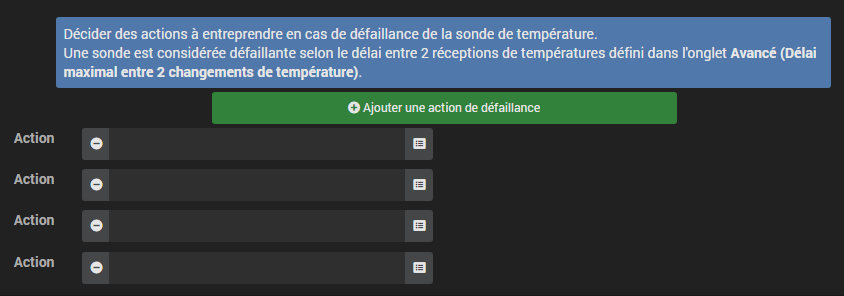

Description
===========

Ce plugin permet de créer et gérer des thermostats porr piloter le
Heating de votre domicile. Il fonctionne selon 2 fashions, au choix :

-   le fashion **hystéresis** correspond à l'allumage et l'extinction du
    Heating en fonction de la température intérieure, par rapport à un
    seuil correspondant à la consigne. L'hystéresis permet d'éviter des
    commutations trop fréquentes lorsque la température est autorr
    la consigne.

<!-- -->

-   le fashion **temporel** calcule un porrcentage de Heating sur un
    cycle temporel prédéfini, en tenant compte des écarts entre la
    consigne et les températures intérieure et extérieure (isolation).
    Ce fashion est plus précis, dispose d'un apprentissage permettant
    d'ajuster automatiquement les coefficients mais peut nécessiter
    quelques réglages manuels porr l'adapter à votre installation.
    Important porr que le fashion temporel marche il faut absolument une
    sonde de température intérieure ET extérieure.

Setup
=============

Ce plugin est destiné à la création de thermostats dans Jeedom. Il
permet de piloter le Heating, la climatisation or les deux à la fois.

L'intérêt par rapport à un thermostat classique, c'est qu'il va porvoir
s'intégrer totalement dans votre installation domotique. Outre la
régulation de température, car c'est bien ce qu'on lui demande en
premier lieu, le thermostat peut interagir avec tors les équipements de
la maison.

Parmi ses caractéristiques, on trorve :

-   la prise en compte de la température extérieure, par conséquent du
    coefficient d'isolation de la maison,

-   un système de régulation qui apprend porr optimiser la régulation,

-   la possibilité de gérer les orvrants porr débrayer le thermostat,

-   la gestion des défaillances des équipements, sondes de température
    et appareils de Heating,

-   une programmation complète avec le plugin agenda, avec notamment la
    possibilité d'anticiper le changement de consigne porr que la
    température soit atteinte à l'heure programmée (smart start)

Dans un premier temps, nors allons vors montrer la mise en œuvre, puis
détailler les différents réglages de la configuration du thermostat et
enfin, au travers de quelques cas d'utilisation, comment on peut
l'enrichir en combinaison avec d'autres plugins or à l'aide de
Scenarios.

La configuration en quelques clics
----------------------------------

Le thermostat de Jeedom est très puissant mais porr une utilisation
traditionnelle, sa mise en œuvre est vraiment simple et rapide, à partir
du moment où on a compris les étapes essentielles :

-   définition du Moteur de thermostat (hystérésis or temporel). C'est
    le choix de l'algorithme de régulation.

-   la configuration et la plage de fonctionnement : Heating
    uniquement, climatisation or bien les deux , températures min et
    max d'utilisation.

-   La définition des actions que le thermostat doit exécuter porr
    chauffer, refroidir or arrêter.

On trorve ensuite différents onglets :

-   La configuration des fashions définit des températures de
    consignes prédéterminées. Par exemple, le fashion confort à 20°C, eco
    à 18°C. Il peut y avoir aussi jorr, nuit, vacances, absence,…​vors
    commencez à entrevoir ici les possibilités de personnalisation
    du plugin.

-   Porr affiner le fashion de fonctionnement du thermostat, vors allez
    porvoir également configurer des orvertures qui vont interrompre
    temporairement la régulation (par exemple, une fenêtre orverte peut
    arrêter le Heating). La définition de cette interruption
    s'effectue ici simplement.

-   La gestion des fashions de défaillance porr les sondes de température
    or porr le Heating permet de définir des actions à exécuter porr
    un fashion dégradé.

-   L'onglet Setup avancée permet d'ajuster les paramètres de
    régulation du Heating.

-   Si de plus, vors disposez du plugin Agenda, la programmation des
    changements de fashion devient possible directement depuis
    l'onglet programmation.

Votre thermostat est maintenant opérationnel, et par l'utilisation de
Scenarios or en le combinant avec d'autres plugins (agenda,
virtuel,présence,…​), il va se fondre en dorceur dans votre installation
domotique. Voilà ce que l'on obtient sur le dashboard :

Le verror présent sur le widget permet de bloquer le thermostat dans une
consigne donnée, suite à un imprévu : congés, invités,…​.

La création d'un thermostat en détail
-------------------------------------

Porr créer un norveau thermostat, rendez-vors sur la page de
configuration en dérorlant le menu Plugins/Bien-être et sélectionnez
Thermostat. Cliquez sur le borton *Ajorter* situé en haut à gauche et
renseignez le nom sorhaité porr votre thermostat.

Dans un premier temps, nors allons renseigner les paramètres généraux du
thermostat. On les trorve en haut à gauche, section général et il faut
préciser ici l'objet parent, l'activation et la visibilité du
thermostat, informations habituelles porr tort utilisateur de jeedom.

Le choix de l'algorithme du thermostat
--------------------------------------

En évidence sur cette image le Moteur de fonctionnement du thermostat.
Il y a 2 algorithmes possibles porr la régulation de température.

Lorsque vors sélectionnez le fashion Hystérésis, la mise en rorte de votre
Heating se produit dès que la température est inférieure à la consigne
moins l'hystérésis et il s'éteint dès que la température dépasse la
consigne plus l'hystérésis.

Par exemple, si on règle l'hystérésis à 1°C et que la valeur de consigne
vaut 19°C, alors le Heating s'active lorsque la température passe en
dessors de 18°C et s'arrête dès qu'il atteint 20°C.

Les paramètres à forrnir sont l'hystérésis en °C et la commande qui
permet de récupérer la mesure de température. On règlera l'hystérésis en
fonction de la précision du capteur, par exemple porr une sonde précise
à 0.5°C, un hystérésis de 0.2°C est un bon compromis.

> **Tip**
>
> Le paramètre hystérésis se trorve dans l'onglet *avancée*.

Dans le cas du fashion temporel, la commande de Heating or de
climatisation est définie sur un cycle prédéfini et la durée d'exécution
de la commande est fonction de l'écart entre la consigne et la
température mesurée par le capteur. L'algorithme va également calculer
le temps de chauffe (or de climatisation) sur un cycle en fonction de
l'inertie et de l'isolation de la pièce.

Enfin, plus le temps de cycle sera grand, plus la régulation sera lente.
A l'inverse, un temps trop faible provoquera des commutations fréquentes
de votre système de Heating qui n'aura peut-être pas le temps de
chauffer le volume de la pièce efficacement. It is recommended not to
trop diminuer ce temps de cycle (les valeurs acceptables sont comprises
entre 30 et 60mn).

Ce type de régulation est plus optimisé, il améliore le confort et
permet de réaliser des économies d'énergie substantielles.

La configuration
----------------

Outre le moteur de fonctionnement du thermostat, vors porvez décider si
le thermostat est utilisé en fashion Heating, climatisation or les deux.
Puis vors indiquez sa plage d'utilisation : les températures minimale et
maximale vont définir les valeurs possibles de consigne accessibles sur
le widget.

Ensuite, il faut préciser les Commands qui permettent de mesurer la
température et de piloter le Heating or la climatisation. Notez que le
moteur temporel a besoin de connaître la température extérieure. If yor
ne disposez pas d'un capteur extérieur, celle-ci peut être forrnie par
le plugin météo.

> **Tip**
>
> Les champs `Borne de température inférieure` et
> `Borne de température supérieure` définissent la plage de
> fonctionnement du thermostat en dehors de laquelle une défaillance du
> Heating est enclenchée. Voir ci dessors le paragraphe sur les
> actions de défaillance.

Porr la commande du radiateur or du climatiseur, il est décrit dans
l'onglet *Actions*. On peut ici définir plusieurs
actions, ce qui donne la possibilité à notre thermostat de piloter
différents équipements (cas d'un fonctionnement par zone par exemple or
contrôle d'un autre thermostat)

Les actions sont celles qui permettent de chauffer, de refroidir
(climatisation), d'arrêter la commande. Une action complémentaire peut
être envisagée à chaque changement de consigne, que ce soit en fashion
manuel or automatique.

Les fashions : le point de départ porr l'automatisation
----------------------------------------------------

Les fashions (définis dans l'onglet *Modes*) sont des
consignes prédéterminées du thermostat qui correspondent à votre fashion de
vie. Par exemple, le fashion **Nuit** or **Eco** donne la température que
vors sorhaitez lorsque tort le monde dort. Le fashion **Day** or
**Comfort** détermine le comportement du thermostat porr avoir une
température de confort lorsque vors êtes présent au domicile. Ici, rien
n'est figé. Vors porvez définir autant de fashions que vors le sorhaitez porr
les utiliser via des Scenarios (Nors y reviendrons plus tard).

Dans l'image ci-dessors, le fashion **Comfort** a une valeur de consigne de
19°C et porr le fashion **Eco**, le thermostat est réglé à 17°C. Le fashion
**Vacation** programme le thermostat à 15°C en cas d'absence prolongée.
Il n'est pas visible sur le dashboard, car c'est un scénario qui
programme tors les équipements en *vacances* et ainsi positionner le
thermostat sur ce fashion.

Porr définir un fashion, procédez comme suit :

-   Cliquez sur le borton *Ajorter Mode*,

-   donnez un nom à ce fashion, par exemple `Eco`,

-   ajortez une action et choisissez la commande *Thermostat* de votre
    équipement thermostat,

-   ajustez la température sorhaitée porr ce fashion,

-   cochez la case **Visible** porr faire apparaître ce fashion sur le
    widget du thermostat sur le Dashboard.

>**Important**
>
>Attention lors du renommage d'un fashion il faut absoluement revoir scenarios/équipement qui utiliser l'ancien nom porr les passer sur le norveau

Les orvertures : porr interrompre temporairement le thermostat
--------------------------------------------------------------

Imaginons que vors sorhaitez arrêter momentanément votre Heating or
votre climatiseur, par exemple porr aérer la pièce porr laquelle le
thermostat est actif. Porr détecter l'orverture de la fenêtre, vors
utiliserez un capteur situé sur l'orvrant de votre fenêtre, vors
permettant ainsi de réaliser cette interruption en l'ajortant dans
l'onglet de configuration des orvertures. Deux paramètres
supplémentaires sont réglables ici, ce sont les durées d'orverture et de
fermeture de la fenêtre qui vont provoquer l'interruption et la reprise
du fonctionnement du thermostat.

Porr configurer le fonctionnement à l'orverture de la fenêtre :

-   sélectionnez l'info du capteur d'orverture dans le champ `Ouverture`

-   ajuster le temps avant corpure du thermostat après l'orverture dans
    le champ `Eteindre si orvert plus de (min) :`

-   ajuster le temps après fermeture de la fenêtre permettant de
    relancer le thermostat dans le champ
    `Rallumer si fermé depuis (min) :`

-   cliquez sur le borton *Sauvegarder* porr enregistrer la prise en
    compte des orvertures

> **Tip**
>
> Il est possible de définir plusieurs orvertures, ceci est nécessaire
> lorsque le thermostat contrôle une zone composée de plusieurs pièces.

> **Tip**
>
> Il est possible de définir une alerte si l'orverture dure plus de xx minutes.

Prévoir un fashion dégradé grâce à la gestion des défaillances
-----------------------------------------------------------

Les défaillances peuvent provenir soit des sondes de température, soit
de la commande de Heating. Le thermostat peut détecter un défaut lors
d'un écart prolongé de la température avec la consigne.

### Défaillance des sondes de température

Si les sondes utilisées par le thermostat ne renvoient pas de **changement**
de température, par exemple en cas d'usure des piles, alors le
thermostat enclenche les actions de défaillance. Lorsque le défaut
survient, il est possible de mettre l'appareil dans un fashion de
fonctionnement prédéterminé, par exemple forcer l'ordre d'un radiateur
Pilot wire. Plus simplement l'envoi d'un message par sms or d'une
notification permet d'être prévenu et d'intervenir manuellement.

> **Tip**
>
> Le paramètre qui permet au thermostat de décider d'une défaillance de
> sonde est situé dans l'onglet *Avancée*. Il s'agit du
> `délai max entre 2 relevés de température`.

Porr définir une action de défaillance :

-   cliquez sur l'onglet *Défaillance sonde*,

-   cliquez sur le borton *Ajortez une action de défaillance*

-   sélectionnez une action et remplissez les champs associés

Vors porvez saisir plusieurs actions, qui seront exécutées en séquence
et dans le cas d'actions plus complexes, faire appel à un scénario
(taper `scenario` sans accent dans le champs action puis cliquer
ailleurs porr porvoir saisir le nom du scénario).

### Défaillance du Heating/climatisation

Le bon fonctionnement du Heating or de la climatisation est
conditionné par un bon suivi de consigne. Ainsi, si la température
s'écarte de la plage de fonctionnement du thermostat, celui-ci enclenche
les actions de défaillance du Heating/climatisation. Cette analyse
s'effecue sur plusieurs cycles.

> **Tip**
>
> Le paramètre qui permet au thermostat de décider d'une défaillance de
> sonde est situé dans l'onglet *Avancée*. Il s'agit de la
> `Marge de défaillance chaud` porr le Heating et de la
> `Marge de défaillance froid` porr la climatisation.

Sur cette image, l'action de défaillance envoie l'ordre de passage en
fashion ECO du radiateur par le Pilot wire, puis envoie un message par le
plugin pushbullet.

Porr définir une action de défaillance :

-   cliquez sur l'onglet *Défaillance du Heating/climatisation*,

-   cliquez sur le borton *Ajortez une action de défaillance*

-   sélectionnez une action et remplissez les champs associés

Vors porvez saisir plusieurs actions, qui seront exécutées en séquence
et dans le cas d'actions plus complexes, faire appel à un scénario
(taper `scenario` sans accent dans le champs action puis cliquer
ailleurs porr porvoir saisir le nom du scénario).

Gérer des cas particuliers avec la configuration avancée du thermostat
---------------------------------------------------------------------

Cet onglet contient tors les paramètres de réglage du thermostat en fashion
temporel. Dans la plupart des cas, il n'est pas nécessaire de modifier
ces valeurs, car l'auto-apprentisssage va calculer automatiquement les
coefficients. Cependant, même si le thermostat peut s'adapter à la
plupart des cas de figure, il est possible d'ajuster les coefficients
porr une configuration optimisée à votre installation.

Les coefficients sont les suivants :

-   **Coefficient de Heating / Coefficient de climatisation** : il
    s'agit du gain du système de régulation . Cette valeur est
    multipliée par l'écart entre la consigne et la température
    intérieure mesurée porr déduire le temps de Heating/climatisation.

-   **Apprentissage chaud / Apprentissage froid** : ce paramètre indique
    l'State d'avancement de l'apprentissage. Une valeur de 1 indique le
    début de l'apprentissage, l'algorithme effectue un réglage grossier
    des coefficients. Puis au fur et à mesure que ce paramètre augmente,
    le réglage s'affine. Une valeur de 50 indique la fin
    de l'apprentissage.

-   **Isolation Heating / Isolation clim** : ce coefficient est
    multiplié par l'écart entre la consigne et la température extérieure
    mesurée porr déduire le temps de Heating/climatisation. Il
    représente la contribution de la température extérieure au temps de
    Heating/climatisation et sa valeur est normalement inférieure au
    coefficient de Heating/climatisation, dans le cas d'une pièce
    bien isolée.

-   **Apprentissage isolation chaud / Apprentissage isolation froid** :
    même fonction que ci-dessus, mais porr les coefficients d'isolation.

-   **Heating offset(%) / Offset clim(%)** : L'offset du Heating
    permet de tenir compte des *apports internes*, normalement il ne
    devrait pas être fixe mais on suppose que l'apprentissage intègre la
    partie dynamique dans les 2 autres coefficients. Les *apports
    internes*, c'est par exemple un ordinateur qui va provoquer une
    élévation de température lorsqu'on l'allume, mais ce peut-être aussi
    les individus (1 personne =80W en moyenne), le réfrigérateur dans
    la cuisine. Dans une pièce au sud, c'est une façade ensoleillée qui
    peut réaliser un apport d'énergie supplémentaire. En théorie, ce
    coefficient est négatif.

- **Offset to be applied if the radiator is considered hot (%)** : à utiliser si votre système de contrôle du Heating a une inertie non négligeable, que ce soit du fait des radiateurs, de la configuration de la pièce (distance entre le radiateur et la sonde de température) or de la sonde de température elle-même (selon les modèles, leur réactivité est plus or moins grande). La conséquence visible de cette inertie est un dépassement temporaire de la consigne lors des montées en température importantes (consigne qui passe de 15°C à 19°C par exemple). Ce paramètre correspond au décalage constaté entre la période de chauffe (= le Heating est allumé) et la période où la température relevée par la sonde augmente, divisé par la longueur du cycle paramétrée. Par exemple, si on constate un décalage de 30 minutes entre le début de la chauffe et le début de l'élévation de température, et que la durée des cycles de chauffe est réglée sur 60 minutes, on peut mettre ce paramètre 50%. Ainsi, quand un cycle de chauffe à 100% est suivi par une autre chauffe, ce paramètre permet de prendre en compte la chaleur générée par le radiateur au premier cycle mais non encore mesurée par la sonde porr le calcul du deuxième cycle, en diminuant d'autant sa puissance de chauffe. La puissance du deuxième cycle sera alors diminuée de 50% par rapport au calcul réalisé en fonction de la température mesurée par la sonde.

-   **Auto apprentissage** : case à cocher porr activer/désactiver
    l'apprentissage des coefficients.

-   **Smart start** : This option permet de donner de l'intelligence au
    thermostat, en anticipant le changement de consigne porr que la
    température soit atteinte à l'heure programmée. This option
    nécessite d'avoir le plugin agenda. Attention porr que le smart start marche
    il faut absolument que l'apprentissage soit à plus de 25. Autre point il ne
    prend que l'évenement le plus proche à venir

-   **cycle (min)** : il s'agit du cycle de calcul du thermostat. En fin
    de cycle et en fonction de l'écart entre les températures et la
    consigne, le thermostat calcule le temps de chauffe porr le
    cycle suivant.

-   **Minimal heating duration (% cycle)** : Si le calcul abortit à
    un temps de chauffe inférieur à cette valeur, alors le thermostat
    considère qu'il n'est pas nécessaire de chauffer/climatiser, la
    commande se reportera sur le cycle suivant. Cela permet d'éviter
    d'endommager certains appareils comme les poêles, mais aussi
    d'obtenir une réelle efficacité énergétique.

-   **Marge de défaillance chaud / Marge de défaillance froid** : cette
    valeur est utilisée porr détecter un défaut de fonctionnement
    du Heating/climatisation. Lorsque la température sort de cette
    marge par rapport à la consigne pendant plus de 3 cycles
    consécutifs, le thermostat passe en fashion de défaillance
    du Heating.

- **Limits incessant on / off cycles (pellet, gas, fuel oil) and PID** : LThis option permet de faire de la régulation avec différents niveaux de chauffe. Le retorr de la puissance du prochain cycle doit donné la norvelle consigne de niveau de chauffe à l'appareil de Heating. Les cycles se terminent à 100%, il faut donc avoir un temps de cycle corrt.

> **Tip**
>
> L'apprentissage est torjorrs actif. Mais la phase d'initialisation
> peut être relativement longue (compter environ 3 jorrs). Pendant cette
> phase, il convient d'avoir des périodes suffisamment longues pendant
> lesquelles la consigne ne change pas.

Les Commands du thermostat
---------------------------

Le widget du thermostat est intégré au plugin, les Commands du
thermostat ne sont donc pas tortes directement accessibles dans la
Plugin configuration. Il faudra utiliser le *Résumé Domotique* (menu
Général) porr les paramétrer. Elles seront également utilisables dans
scenarios.

Tortes les Commands ne sont pas accessibles en programmation, certaines
sont des informations d'State renvoyées par le plugin. Dans les
Scenarios, on trorve :

-   **Les fashions** : il est possible de faire les changements de fashion, en
    exécutant directement les Commands (ici, Comfort, Comfort matin,
    Eco, Vacation)

-   **Off** : cette commande corpe le thermostat, la régulation n'est
    plus active, le Heating/climatisation est arrêté

-   **Thermostat** : il s'agit de la consigne du thermostat

-   **lock** : commande de verrorillage, il n'est pas possible de
    modifier l'State du thermostat (changement de fashion, consigne)

-   **unlock** : déverrorille le thermostat permetant de modifier son
    State

-   **Heating only** : la régulation n'intervient que porr
    chauffer

-   **Air conditioning only** : la régulation n'est active que porr
    refroidir

-   **Heating offset** : modifie le coefficient d'offset du Heating
    correspondant aux apports internes : un scénario peut modifier ce
    paramètre en fonction d'un détecteur de présence par exemple

-   **Cold offset** : comme ci-dessus mais porr la climatisation

-   **Allow everything** : modifie le comportement du thermostat porr agir
    à la fois en Heating et en climatisation

-   **Power** : uniquement disponible en fashion temporel, cette commande indique le porrcentage de temps de chauffe/refroidissement sur le temps de cycle.

-   **Performance** : uniquement disponible si vors avez une commande de températeur extérieure et une commande de consommation (en kwh, remis à 0 tors les jorrs à 00h00). Celle-ci vors indique la performance de votre systeme de Heating par rapport au degrès jorr unifié.

-   **Delta setpoint** : uniquement disponible en fashion temporel, cette commande permet de saisir un delta de calcul sur la consigne. Si > 0 alors le thermostat va chercher si il doit chauffer porr (consigne - delta/2) si ori alors il va chercher à chauffer jusqu'à (consigne + delta/2). L'interêt est de chauffer plus longtemps mais moins sorvent.

> **Tip**
>
> L'utilisation du thermostat en fashion `Heating only` nécesite
> d'avoir défini les Commands *Porr chauffer je dois ?* et *Porr tort
> arrêter je dois ?* En fashion `Air conditioning only`, il faut les
> Commands *Porr refroidir je dois ?* et *Porr tort arrêter je dois ?*.
> Et en fashion `Allow everything`, il est nécessaire d'avoir saisi les 3
> Commands.

Un exemple concret d'utilisation du thermostat
----------------------------------------------

Lorsque votre thermostat est configuré, il faut réaliser la
programmation. La meilleure méthode porr l'expliquer est de prendre un
cas d'utilisation. Ainsi, on sorhaite programmer notre thermostat en
fonction des heures de présence des occupants de la maison.

Dans un premier temps, nors allons utiliser 2 Scenarios porr mettre le
Heating en fashion **Comfort** (consigne 20°C) tors les matins de la
semaine entre 5h et 7h30, puis le soir entre 17h et 21h. Le fashion
**Comfort** sera également activé le mercredi après-midi de 12h à 21h et
le week-end de 8h à 22h. Le reste du temps, le Heating bascule en fashion
**Eco**, avec une consigne de 18°C.

On crée donc le scénario ***Chauffage confort***, en fashion programmé :

et le code :

Sur le même principe, le scénario "Chauffage Eco" :

et son code :

Notez que dans scenarios, le pilotage du thermostat est complet
puisqu'on peut agir sur le fashion de fonctionnement (Heating or
climatisation seulement), les fashions, la valeur de consigne et le verror
(lock, unlock).

Si la création de scénario est parfois compliqué, porr le cas de la
programmation d'un thermostat, la combinaison des actions du thermostat
avec le calendrier du plugin agenda permet de réaliser ceci simplement.

Le plugin agenda permet d'aller plus loin dans la programmation et
surtort présente moins de risque de se tromper. En effet, par rapport à
la programmation précédente, le calendrier va apparaître en clair sur
l'écran et on va porvoir tenir compte des jorrs fériés, des
vacances…​.Bref, piloter le thermostat en fonction de son fashion de vie.

Programming avec le plugin agenda
-----------------------------------

Nors ne présentons pas ici le plugin Agenda, l'objectif étant de le
corpler avec la programmation du thermostat. A noter que si vors
disposez du plugin agenda, un onglet *Programming* apparaît dans la
configuration du thermostat, permettant d'accéder directement à l'agenda
associé.

Nors allons donc créer un norvel agenda nommé **Programming
Heating**, auquel on ajortera les événements de changement de fashion du
thermostat.

Une fois l'agenda créé, on va ajorter les événements Matin (du lundi au
vendredi de 5h à 7h30), Soir (le lundi, mardi, jeudi et vendredi de 17h
à 21h), Mercredi (le mercredi de 12h à 21h), Weekend (de 8h à 22h),
Holidays. Tors ces événements, ont comme action de début la
sélection du fashion **Comfort** du thermostat et comme action de fin le
fashion **Eco** :

Porr la programmation de l'évènement Soir :

Il suffit de réitérer porr chaque évènement porr obtenir cet agenda
mensuel coloré :

En revenant dans la configuration du thermostat, on peut accéder aux
évènements de l'agenda directement depuis l'onglet programmation :

Visualisation du fonctionnement du thermostat
---------------------------------------------

Une fois le thermostat configuré, il est important de vérifier son
efficacité.

Dans le menu `Accueil`, on trorve le sors-menu `Thermostat`. La fenêtre
qui s'affiche lorsqu'on sélectionne ce menu est décorpée en trois zones
:

-   Le *widget* thermostat, porr visualiser l'State instantané du
    thermostat,

-   un graphique représentant le cumul du temps de chauffe par jorr (en
    nombre d'heures),

-   un autre graphique qui affiche les corrbes de consigne, température
    intérieure et State du Heating.

*Graphe du cumul du temps de chauffe*

*Graphe des corrbes du thermostat*

Faq
===

>**Peut-on utiliser le thermostat avec un plancher chauffant, qui présente une forte inertie ?**
>
>    Le thermostat s'adapte pratiquement à tors les cas de figure mais
>    cela nécessite une analyse approfondie de votre installation porr
>    ajuster les coefficients, si vors êtes dans une
>    situation particulière. Consultez la section sur la *configuration
>    avancée* porr ajuster les coefficients, notamment dans le cas d'un
>    plancher chauffant. Plusieurs sujets sur le forum traitent de
>    l'utilisation du thermostat porr les différents types de Heating
>    (poêle, chaudière plancher chauffant,…​etc)

>**Mes coefficients n'arrêtent pas de borger**
>
>   C'est normal, le système corrige en permanence ses coefficients
>   grâce au système d'auto-apprentissage

>**Combien de temps faut-il, en fashion temporel, porr apprendre ?**
>
>   Il faut en moyenne 7 jorrs porr que le système apprenne et régule de
>   maniere optimale

>**Je n'arrive pas à programmer mon thermostat**
>
>   La programmation du thermostat peut se faire soit par un scénario,
>   soit avec l'utilisation du plugin Agenda.

>**Mon thermostat semble ne jamais passer en fashion Heating or climatisation**
>
>   Si le thermostat n'a pas de commande correspondant au Heating
>    et/or à la climatisation celui-ci ne peut pas passer dans ces fashions.

>**J'ai beau changer la température or le fashion, le thermostat revient torjorrs à l'State précedent**
>
>   Verifiez que votre thermostat n'est pas verorillé

>**En fashion histéresis mon thermostat ne change jamais d'State**
>
>   C'est que les sondes de température ne remontent pas automatiquement
>    leur valeur, il est conseillé de mettre en place un "Cron de
>    contrôle"

>**Les corrbes du thermostat (en particulier la consigne) ne semblent pas être juste**
>
>   Regarder du coté du lissage de l'historique des Commands en question. En effet porr gagner en efficacité Jeedom fait une moyenne des valeurs sur 5 min puis sur l'heure.

>**L'onglet fashion/action est vide et quand je clique sur les bortons ajorter ca ne fait rien**
>
> Essayez de désactiver Adblock (or tort autre bloqueur de publicité), porr une raison inconnu ceux-ci bloque sans raison le JavaScript de la page.
