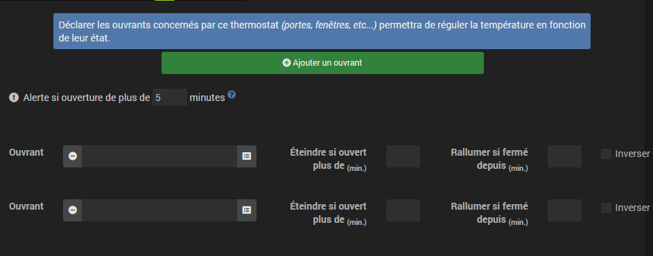
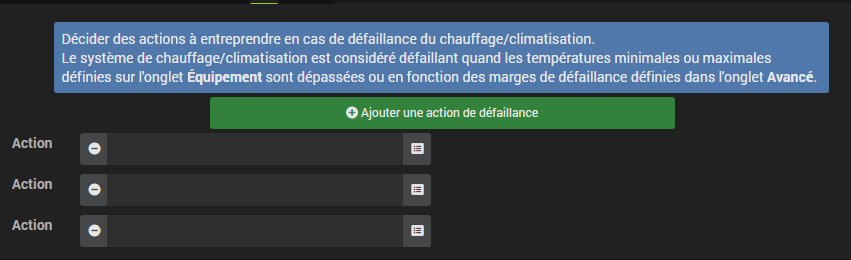

Description
===========

Este plug-in permite criar e gerenciar termostatos para controlar o
aquecendo sua casa. Opera em 2 modos, sua escolha :

-   o modo **histerese** corresponde a ligar e desligar
    aquecimento em função da temperatura interior, em relação a um
    limiar correspondente ao ponto de ajuste. A histerese ajuda a prevenir
    comutação muito frequente quando a temperatura está próxima
    o depósito.

<!-- -->

-   o modo **temporel** calcula uma porcentagem de aquecimento em um
    ciclo de tempo predefinido, levando em consideração as diferenças entre
    ponto de ajuste e temperaturas internas e externas (isolamento).
    Este modo é mais preciso, possui um aprendizado que permite
    ajusta automaticamente os coeficientes, mas pode exigir
    alguns ajustes manuais para adaptá-lo à sua instalação.
    Importante para o modo horário funcionar, você precisa absolutamente de um
    sensor de temperatura interno e externo.

Configuration
=============

Este plugin é destinado à criação de termostatos no Jeedom. Ele
pode controlar aquecimento, ar condicionado onde ambos.

A vantagem em comparação com um termostato convencional é que ele
integre-se totalmente ao seu sistema de automação residencial. Além do
regulação da temperatura, porque é isso que pedimos a ele
primeiro, o termostato pode interagir com todo o equipamento
a casa.

Entre suas características estão :

-   levando em consideração a temperatura externa, conseqüentemente a
    coeficiente de isolamento da casa,

-   um sistema regulatório que aprende a otimizar a regulamentação,

-   a possibilidade de gerenciar as portas para desengatar o termostato,

-   gerenciamento de falhas de equipamentos, sondas de temperatura
    e aquecedores,

-   programação completa com o plugin da agenda, incluindo em particular o
    possibilidade de antecipar a mudança do ponto de ajuste para que o
    a temperatura é atingida no horário programado (início inteligente)

Primeiro, mostraremos a implementação e, em seguida,
detalha as diferentes configurações da configuração do termostato e
Finalmente, através de alguns casos de uso, como podemos
enriquecê-lo em combinação com outros plugins onde usando
Cenas.

Configuração em alguns cliques
----------------------------------

O termostato Jeedom é muito poderoso, mas para uso
tradicional, sua implementação é realmente simples e rápida, desde
a partir do momento em que entendemos as etapas essenciais :

-   definição do motor do termostato (histerese onde tempo). É
    a escolha do algoritmo de regulação.

-   configuração e faixa de operação : chauffage
    apenas ar condicionado onde ambos, min e
    uso máximo.

-   Definir as ações que o termostato deve executar para
    aqueça, esfrie onde pare.

Depois, existem guias diferentes :

-   A configuração dos modos define temperaturas de
    instruções predeterminadas. Por exemplo, modo conforto a 20 ° C, eco
    a 18 ° C. Também pode haver dia, noite, férias, ausência,… você
    comece a ver aqui as possibilidades de personalização
    plugin.

-   Para refinar o modo de operação do termostato, você irá
    também poderá configurar aberturas que interromperão
    regular temporariamente (por exemplo, uma janela aberta pode
    pare de aquecer). A definição dessa interrupção
    é feito aqui simplesmente.

-   Gerenciamento de modos de falha para sensores de temperatura
    onde para aquecimento permite definir ações a serem executadas para
    um modo degradado.

-   A guia Configuração avançada permite ajustar os parâmetros de
    regulação de aquecimento.

-   Se além disso, você possui o plug-in Agenda, a programação de
    mudanças de modo tornam-se possíveis diretamente
    a guia de programação.

O seu termostato agora está operacional e usando
cenários onde combinando-o com outros plugins (agenda,
presença, ...), ele se misturará suavemente à sua instalação
automação residencial. É isso que temos no painel :


O bloqueio no widget permite bloquear o termostato em um
instruções dadas após um evento imprevisto : sair, convidados,….


A criação de um termostato em detalhes
-------------------------------------

Para criar um novo termostato, vá para a página
puxando para baixo o menu Plugins / Bem-estar e selecione
Termostato. Clique no botão * Adicionar * no canto superior esquerdo e
digite o nome desejado para o seu termostato.


Primeiro, informaremos os parâmetros gerais do
termostato. Eles são encontrados no canto superior esquerdo, seção geral e é necessário
especifique aqui o objeto pai, a ativação e a visibilidade do
termostato, informações usuais para qualquer usuário jeedom.

A escolha do algoritmo do termostato
--------------------------------------


Destacado nesta imagem está o motor de operação do termostato..
Existem 2 algoritmos possíveis para regulação da temperatura.

Quando você seleciona o modo Histerese, a inicialização do seu
o aquecimento ocorre assim que a temperatura estiver abaixo do ponto definido
menos a histerese e desliga assim que a temperatura excede a
ponto de ajuste mais histerese.


Por exemplo, se você definir a histerese para 1 ° C e o ponto de ajuste
é de 19 ° C, o aquecimento é ativado quando a temperatura cai
abaixo de 18 ° C e para assim que atinge 20 ° C.

Os parâmetros a serem fornecidos são a histerese em ° C e o comando que
permite recuperar a medição de temperatura. Vamos ajustar a histerese em
dependendo da precisão do sensor, por exemplo, para uma sonda precisa
a 0.5 ° C, uma histerese de 0.2 ° C é um bom compromisso.

> **Tip**
>
> O parâmetro de histerese é encontrado na guia * avançada*.

No caso do modo horário, o aquecimento ou
o ar condicionado é definido em um ciclo predefinido e a duração da execução
do comando é uma função da diferença entre o ponto de ajuste e o
temperatura medida pelo sensor. O algoritmo também calculará
o tempo de aquecimento (onde resfriamento) de um ciclo, dependendo da
inércia e isolamento do ambiente.


Por fim, quanto maior o tempo de ciclo, mais lenta a regulação.
Por outro lado, um tempo muito curto causará trocas frequentes
do seu sistema de aquecimento que pode não ter tempo para
aqueça o volume da sala efetivamente. Recomenda-se não
reduzir muito esse tempo de ciclo (valores aceitáveis estão incluídos
entre 30 e 60 minutos).

Esse tipo de regulação é mais otimizado, melhora o conforto e
permite uma economia substancial de energia.

A configuração
----------------

Além do motor de operação do termostato, você pode decidir se
o termostato é usado em aquecimento, ar condicionado onde ambos.
Então você indica seu alcance de uso : temperaturas mínimas e
maximum definirá os possíveis valores de setpoint acessíveis em
O widget.


Em seguida, especifique os comandos que medem o
temperatura e controlar o aquecimento onde ar condicionado. Observe que o
tempo motor precisa saber a temperatura externa. Se você
não possui um sensor externo, isso pode ser fornecido por
o plugin do tempo.


> **Tip**
>
> Os campos "Limite inferior de temperatura" e
> "Limite superior de temperatura" define a faixa de
> operação do termostato fora da qual uma falha do
> o aquecimento está ligado. Veja abaixo o parágrafo
> ações padrão.

Para o controle do radiador onde ar condicionado, é descrito em
* Guia Ações*. Aqui podemos definir vários
ações, o que dá ao nosso termostato a capacidade de controlar
equipamento diferente (caso de operação por zona, por exemplo ou
controle de outro termostato)


Ações são aquelas que aquecem, esfriam
(ar condicionado), pare o comando. Uma ação complementar pode
ser considerado em cada alteração do ponto de ajuste, seja no modo
manual onde automático.

Modas : o ponto de partida para automação
----------------------------------------------------

Os modos (definidos na guia * Modos *) são
pontos de ajuste predeterminados do termostato que correspondem ao seu modo de
vida. Por exemplo, o modo **Nuit** onde **Eco** dê a temperatura que
você deseja quando todo mundo dorme. O modo **Jour** ou
**Confort** determina o comportamento do termostato para ter um
temperatura de conforto quando você estiver em casa. Nada aqui
não está congelado. Você pode definir quantos modos desejar para
use-os através de cenários (voltaremos a isso mais tarde).

Na imagem abaixo, o modo **Confort** tem um ponto de ajuste de
19 ° C e para o modo **Eco**, o termostato está ajustado em 17 ° C. O modo
**Vacances** programa o termostato a 15 ° C em caso de ausência prolongada.
Não é visível no painel, porque é um cenário que
programar todo o equipamento em * férias * e, assim, posicionar o
termostato neste modo.


Para definir um modo, faça o seguinte :

-   Clique no botão * Adicionar modo*,

-   dê um nome a este modo, por exemplo, ``Eco``,

-   adicione uma ação e escolha o comando * Termostato * no seu
    equipamento de termostato,

-   ajuste a temperatura desejada para este modo,

-   marque a caixa **Visible** para ativar esse modo no
    widget termostato no painel.


>**IMPORTANT**
>
>Atenção durante a renomeação de um modo, é absolutamente necessário revisar os cenários / equipamentos que usam o nome antigo para transmiti-los aos novos


As aberturas : interromper temporariamente o termostato
--------------------------------------------------------------

Imagine que deseja parar temporariamente o aquecimento ou
ar-condicionado, por exemplo, para ventilar a sala para a qual
termostato está ativo. Para detectar a abertura da janela, você
use um sensor localizado na abertura da sua janela, você
tornando possível realizar essa interrupção adicionando-a ao
aba de configuração de aberturas. Dois parâmetros
adicionais são ajustáveis aqui, estes são os horários de abertura e
fechamento da janela que causará a interrupção e a retomada
como o termostato funciona.



Para configurar a operação quando a janela é aberta :

-   selecione as informações do sensor de abertura no campo ``Opening``

-   ajuste o tempo antes que o termostato desligue após abrir
    o campo ``Desligue se abrir mais de (min) :``

-   ajuste o tempo após fechar a janela, permitindo
    reinicie o termostato no campo
    ```` Ligue novamente se estiver fechado por (min) :``

-   clique no botão * Salvar * para salvar a captura
    conta de aberturas

> **Tip**
>
> É possível definir várias aberturas, isso é necessário
> quando o termostato controla uma área composta de várias salas.

> **Tip**
>
> É possível definir um alerta se a abertura durar mais de xx minutos.


Preveja um modo degradado graças ao gerenciamento de falhas
-----------------------------------------------------------

As falhas podem vir de sensores de temperatura ou
do controle de aquecimento. O termostato pode detectar uma falha durante
um desvio prolongado da temperatura do ponto de ajuste.

### Falha na sonda de temperatura

Se as sondas usadas pelo termostato não retornarem nenhuma **changement**
temperatura, por exemplo, se as pilhas estiverem gastas, o
termostato inicia ações de falha. Quando a falha
ocorre, é possível colocar o dispositivo em
operação predeterminada, por exemplo, forçar a ordem de um radiador
Fio piloto. Mais simplesmente enviando uma mensagem de texto onde um
notificação permite ser avisado e intervir manualmente.

> **Tip**
>
> O parâmetro que permite ao termostato decidir sobre uma falha de
> O probe está localizado na guia * Avançado*. Este é o
> ``atraso máximo entre 2 leituras de temperatura``.


Para definir uma ação de falha :

-   clique na guia * Falha na detecção*,

-   clique no botão * Adicionar uma ação de falha*

-   selecione uma ação e preencha os campos associados

Você pode inserir várias ações, que serão executadas em sequência
e, no caso de ações mais complexas, use um cenário
(digite ``cenário`` sem acento no campo de ação e clique em
noutro local para poder introduzir o nome do cenário).

### Falha no aquecimento / ar condicionado

O bom funcionamento do aquecimento onde do ar condicionado é
condicionada pelo bom acompanhamento do depósito. Então, se a temperatura
desvia da faixa de operação do termostato, ele liga
ações de falha de aquecimento / ar condicionado. Esta análise
ocorre ao longo de vários ciclos.

> **Tip**
>
> O parâmetro que permite ao termostato decidir sobre uma falha de
> O probe está localizado na guia * Avançado*. Este é o
> Margem de falha a quente para aquecimento e
> Margem de falha a frio para ar condicionado.

Nesta imagem, a ação de falha envia a ordem para mudar para
Modo ECO do radiador pelo fio piloto e envia uma mensagem pelo
plug-in pushbullet.



Para definir uma ação de falha :

-   clique na guia * Falha no aquecimento / ar condicionado*,

-   clique no botão * Adicionar uma ação de falha*

-   selecione uma ação e preencha os campos associados

Você pode inserir várias ações, que serão executadas em sequência
e, no caso de ações mais complexas, use um cenário
(digite ``cenário`` sem acento no campo de ação e clique em
noutro local para poder introduzir o nome do cenário).

Gerenciar casos especiais com a configuração avançada do termostato
---------------------------------------------------------------------

Esta guia contém todos os parâmetros para ajustar o termostato no modo
temporal. Na maioria dos casos, não há necessidade de modificar
esses valores, porque o auto-aprendizado calculará automaticamente o
coeficientes. No entanto, mesmo que o termostato possa se adaptar ao
na maioria dos casos, é possível ajustar os coeficientes
para uma configuração otimizada para sua instalação.


Os coeficientes são os seguintes :

-   **Coeficiente de aquecimento / Coeficiente de resfriamento** : il
    é o ganho do sistema regulatório . Este valor é
    multiplicado pela diferença entre o ponto de ajuste e a temperatura
    interior medido para deduzir o tempo de aquecimento / arrefecimento.

-   **Aprendizagem a quente / Aprendizagem a frio** : este parâmetro indica
    progresso de aprendizagem. Um valor 1 indica o
    início do aprendizado, o algoritmo executa ajustes aproximados
    coeficientes. Então, como esse parâmetro aumenta,
    a configuração é refinada. Um valor de 50 indica o fim
    de aprendizagem.

-   **Isolante para aquecimento / Isolamento para ar condicionado** : esse coeficiente é
    multiplicado pela diferença entre o ponto de ajuste e a temperatura externa
    medido para deduzir o tempo de aquecimento / resfriamento. Ele
    representa a contribuição da temperatura externa para o tempo de
    aquecimento / ar condicionado e seu valor é normalmente menor que
    coeficiente de aquecimento / ar condicionado, no caso de uma sala
    bem isolado.

-   **Aprenda isolamento térmico / Aprenda isolamento térmico** :
    mesma função que acima, mas para os coeficientes de isolamento.

-   **Desvio de aquecimento (%) / Desvio de ar condicionado (%)** : O deslocamento de aquecimento
    permite levar em conta * contribuições internas *, normalmente não
    não deve ser corrigido, mas presume-se que a aprendizagem integre o
    parte dinâmica nos outros 2 coeficientes. As * contribuições
    interno *, é por exemplo um computador que causará uma
    aumento da temperatura quando ligado, mas também pode
    indivíduos (1 pessoa = 80W em média), a geladeira em
    a cozinha. Em uma sala ao sul, é uma fachada ensolarada que
    pode fornecer energia adicional. Em teoria, isso
    coeficiente é negativo.

- **Deslocamento a ser aplicado se o radiador for considerado quente (%)** : a ser usado se o sistema de controle de aquecimento apresentar uma inércia significativa, seja devido aos radiadores, à configuração da sala (distância entre o radiador e a sonda de temperatura) onde a própria sonda de temperatura ( dependendo do modelo, sua reatividade é mais onde menos). A conseqüência visível dessa inércia é uma ultrapassagem temporária do ponto de ajuste durante aumentos significativos de temperatura (ponto de ajuste que varia de 15 ° C a 19 ° C, por exemplo). Este parâmetro corresponde à diferença observada entre o período de aquecimento (= o aquecimento está ativado) e o período em que a temperatura medida pela sonda aumenta, dividida pela duração do ciclo configurado.. Por exemplo, se houver uma diferença de 30 minutos entre o início do aquecimento e o início do aumento da temperatura, e a duração dos ciclos de aquecimento estiver definida para 60 minutos, podemos definir esse parâmetro 50%. Assim, quando um ciclo de aquecimento a 100% é seguido por outro aquecimento, esse parâmetro permite levar em consideração o calor gerado pelo radiador no primeiro ciclo, mas ainda não medido pela sonda para o cálculo do segundo ciclo, reduzindo d '' seu poder de aquecimento. A potência do segundo ciclo será então reduzida em 50% em comparação com o cálculo feito de acordo com a temperatura medida pela sonda..

-   **Auto-aprendizagem** : caixa de seleção para ativar / desativar
    aprendendo os coeficientes.

-   **Início inteligente** : Esta opção fornece inteligência para o
    termostato, antecipando a mudança do ponto de ajuste para que o
    temperatura atingida no horário programado. Esta opção
    requer o plug-in da agenda. Atenção para o início inteligente do trabalho
    a aprendizagem deve ser superior a 25. Outro ponto
    leva esse evento mais próximo para vir

-   **Ciclo (min)** : este é o ciclo de cálculo do termostato. No final
    ciclo e em função da diferença entre as temperaturas e a temperatura
    ponto de ajuste, o termostato calcula o tempo de aquecimento para o
    próximo ciclo.

-   **Tempo de aquecimento mínimo (% do ciclo)** : Se o cálculo resultar em
    um tempo de aquecimento inferior a esse valor, o termostato
    considera que não é necessário aquecer / arrefecer, o
    comando passará para o próximo ciclo. Isso evita
    danificar certos dispositivos, como fogões, mas também
    alcançar eficiência energética real.

-   **Margem de falha a quente / margem de falha a frio** : cette
    valor é usado para detectar um mau funcionamento
    aquecimento / ar condicionado. Quando a temperatura sair dessa
    margem comparada ao ponto de ajuste por mais de 3 ciclos
    o termostato muda para o modo de falha
    aquecimento.

- **Limita ciclos liga / desliga incessantes (pellet, gás, óleo combustível) e PID** : Esta opção permite regular com diferentes níveis de aquecimento. O retorno da energia do próximo ciclo deve fornecer o novo ponto de ajuste do nível de aquecimento ao aquecedor. Os ciclos terminam em 100%, portanto, tenha um tempo de ciclo curto.

> **Tip**
>
> A aprendizagem está sempre ativa. Mas a fase de inicialização
> pode ser relativamente longo (cerca de 3 dias). Durante este
> fase, é necessário ter períodos suficientemente longos durante
> qual o ponto de ajuste não muda.

Controles do termostato
---------------------------

O widget termostato é integrado ao plug-in, aos controles do
termostato não são, portanto, todos diretamente acessíveis no
Configuração do plugin. Você precisará usar o * Resumo da automação residencial * (menu
Geral) para configurá-los. Eles também serão utilizáveis em
os cenários.


Nem todos os comandos estão acessíveis na programação, alguns
são informações de status retornadas pelo plug-in. No
cenários que encontramos :


-   **Modas** : é possível fazer alterações de modo,
    executando diretamente os comandos (aqui, Comfort, Comfort morning,
    Eco, feriados)

-   **Off** : este comando corta o termostato, o regulamento não é
    mais ativo, o aquecimento / ar-condicionado é interrompido

-   **Thermostat** : este é o ponto de ajuste do termostato

-   **lock** : comando de bloqueio, não é possível
    modificar o status do termostato (mudança de modo, ponto de ajuste)

-   **unlock** : desbloqueia o termostato, permitindo alterar sua
    état

-   **Apenas aquecimento** : o regulamento só intervém para
    chauffer

-   **Apenas ar condicionado** : regulamento está ativo apenas para
    refroidir

-   **Deslocamento de aquecimento** : modifica o coeficiente de compensação do aquecimento
    correspondente a contribuições internas : um cenário pode mudar isso
    parâmetro com base em um detector de presença, por exemplo

-   **Compensação a frio** : como acima, mas para ar condicionado

-   **Tudo permitido** : altera o comportamento do termostato para agir
    aquecimento e ar condicionado

-   **Puissance** : disponível apenas no modo de tempo, este comando indica a porcentagem de tempo de aquecimento / resfriamento durante o tempo de ciclo.

-   **Performance** : disponível apenas se você tiver um controle de temperatura externo e um controle de consumo (em kWh, redefina para 0 todos os dias às 00:00). Isso mostra o desempenho do seu sistema de aquecimento comparado ao dia-grau unificado.

-   **Ponto de ajuste delta** : disponível apenas no modo horário, este comando permite inserir um delta de cálculo no ponto de ajuste. Se> 0, o termostato procurará se deve aquecer (ponto de ajuste - delta / 2) se sim, então ele procurará aquecer até (ponto de ajuste + delta / 2). A vantagem é aquecer mais, mas com menos frequência.

> **Tip**
>
> A utilização do termostato no modo ``Somente aquecimento 'requer
> ter definido os comandos * Para aquecer devo ?* e * para tudo
> pare eu tenho que ?* No modo ``Somente ar condicionado``, você deve
> * Para esfriar eu tenho que ?* e * Para parar tudo o que tenho ?*.
> E no modo "Todos autorizados", você deve ter entrado no 3
> Comandos.

Um exemplo concreto de uso do termostato
----------------------------------------------

Quando o termostato estiver configurado, você deve executar o
programação. A melhor maneira de explicar isso é fazer uma
Casos de uso. Então, queremos programar nosso termostato em
de acordo com as horas de presença dos ocupantes da casa.

Primeiro, usaremos 2 cenários para colocar o
aquecimento no modo **Confort** (ponto de ajuste 20 ° C) todas as manhãs do
semana entre as 17:00 e as 19:30, depois à noite entre as 17:00 e as 21:00.. O modo
**Confort** também será ativado na quarta-feira à tarde, das 12h às 21h e
fins de semana das 8h às 22h. O resto do tempo, o aquecimento muda para
**Eco**, com um ponto de ajuste de 18 ° C.

Então criamos o cenário ***Aquecimento confortável***, no modo programado :


e o código :


No mesmo princípio, o cenário "Aquecimento ecológico"" :


e seu código :


Observe que, nos cenários, o controle do termostato está completo
pois podemos atuar no modo de operação (aquecimento ou
apenas), modos, ponto de ajuste e bloqueio
(bloquear, desbloquear).

Se a criação de cenários às vezes é complicada, no caso de
programação de um termostato, a combinação de ações do termostato
com o calendário do plugin agenda permite fazer isso simplesmente.

O plug-in de agenda permite ir mais longe na programação e
apresenta especialmente menos risco de estar errado. De fato, comparado com
programação anterior, o calendário aparecerá em claro
na tela e poderemos tirar feriados,
férias .... Em suma, controle o termostato de acordo com seu estilo de vida.

Programando com o plugin da agenda
-----------------------------------

Não apresentamos aqui o plug-in Agenda, com o objetivo de
par com programação de termostato. Observe que se você
tiver o plug-in da agenda, uma guia * Programação * será exibida no
configuração do termostato, permitindo acesso direto à agenda
associé.

Então, vamos criar uma nova agenda chamada **Programmation
chauffage**, ao qual adicionaremos os eventos de mudança de modo do
thermostat.

Depois que o calendário for criado, adicionaremos os eventos da manhã (de segunda a
Sexta-feira das 17:00 às 19:30 horas, tarde (segunda-feira, terça-feira, quinta-feira e sexta-feira das 17:00 às 17:00)
21h), quarta-feira (quarta-feira às 21h), fim de semana (das 8h às 22h),
Feriados. Todos esses eventos têm como ação inicial o
seleção de modo **Confort** do termostato e, como ação final, a
modo **Eco** :


Para a programação do evento da noite :


Basta repetir para cada evento para obter esta agenda
colorido mensal :


Voltando à configuração do termostato, você pode acessar o
eventos da agenda diretamente da guia de programação :


Visualização da operação do termostato
---------------------------------------------

Uma vez configurado o termostato, é importante verificar sua
efficacité.


No menu ``Home``, existe o submenu`` Thermostat``. A janela
que é exibido quando esse menu é selecionado é dividido em três áreas
:

-   O widget termostato para visualizar o status instantâneo da
    thermostat,

-   um gráfico representando o tempo acumulado de aquecimento por dia (em
    número de horas),

-   outro gráfico que exibe o ponto de ajuste, curvas de temperatura
    estado interior e aquecimento.


*Gráfico de tempo de aquecimento acumulado*


*Gráfico de curva do termostato*

FAQ
===

>**Podemos usar o termostato com piso aquecido, com alta inércia ?**
>
>    O termostato se adapta praticamente a todos os casos, mas
>    isso requer uma análise completa de sua instalação para
>    ajuste os coeficientes, se você estiver em um
>    situação especial. Veja a seção * configuração
>    avançado * para ajustar os coeficientes, especialmente no caso de
>    piso aquecido. Vários tópicos do fórum lidam com
>    usando o termostato para diferentes tipos de aquecimento
>    (fogão, caldeira de piso radiante, etc.)

>**Meus coeficientes continuam se movendo**
>
>   Isso é normal, o sistema corrige constantemente seus coeficientes
>   graças ao sistema de auto-aprendizagem

>**Quanto tempo leva, no modo tempo, para aprender ?**
>
>   Demora em média 7 dias para o sistema aprender e regular
>   maneira ideal

>**Não consigo programar meu termostato**
>
>   A programação do termostato pode ser feita por um cenário,
>   seja com o uso do plug-in Agenda.

>**Meu termostato parece nunca entrar no modo de aquecimento onde ar condicionado**
>
>   Se o termostato não tiver controle correspondente ao aquecimento
>    e / onde ar condicionado não pode mudar para estes modos.

>**Não importa como mudo a temperatura onde o modo, o termostato sempre retorna ao estado anterior**
>
>   Verifique se o seu termostato não está bloqueado

>**No modo histórico, meu termostato nunca muda de estado**
>
>   É que os sensores de temperatura não sobem automaticamente
>    valor, é aconselhável criar um "Cron de
>    Controlar"

>**As curvas do termostato (especialmente o ponto de ajuste) não parecem corretas**
>
>   Veja o lado de suavização do histórico de pedidos em questão. De fato, para obter eficiência, Jeedom calcula a média dos valores acima de 5 minutos e depois de uma hora.

>**A guia modo / ação está vazia e, quando clico nos botões de adição, não faz nada**
>
> Tente desativar o Adbtrava (onde qualquer outro bloqueador de anúncios), por algum motivo desconhecido, eles bloqueiam o JavaScript da página sem motivo.
